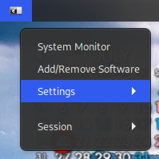
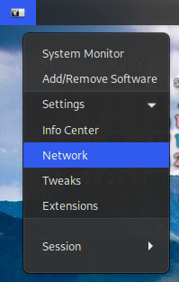
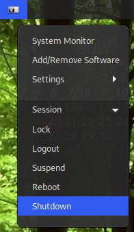

|                    ### Gnome System Menu                     |                                                              |
| :----------------------------------------------------------: | ------------------------------------------------------------ |
| This Gnome Extension creates a small menu in the upper left hand side of the top panel. It looks a little like this. System Monitor opens the Gnome system monitor tool. Add/Remove Programs opens your program manager which can be set in by modifying the extension. It defaults to Pamac. |           |
| If we open the Settings menu we get the following. Each link takes you to its corresponding app. |           |
| If we open up the Session menu, you get the following. Like the Add/Remove program link, Suspend can be changed to use the low power state that you need to use |           |
|                      ### Customization                       |                                                              |
| In order to change the extension to suit your needs, you will need to go to  ~/.local/share/gnome-shell/extensions |                                                              |
| Change the file labeled icon.png to change the icon used for the menu. |                                                              |
|          Open extension.js to change the following           |                                                              |
|            let packageManager = 'pamac-manager';             | change the value between ' ' to your package manager         |
|                 let sleepState = 'suspend';                  | change the value between ' ' to be your preferred low power state. Valid values are suspend , hibernate , hybrid-sleep , suspend-then-hibernate |

